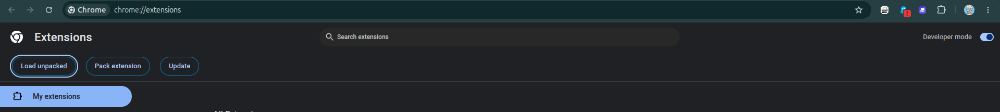
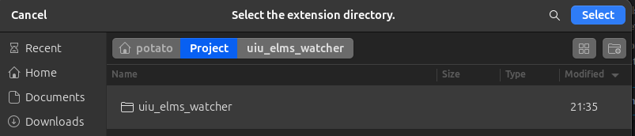
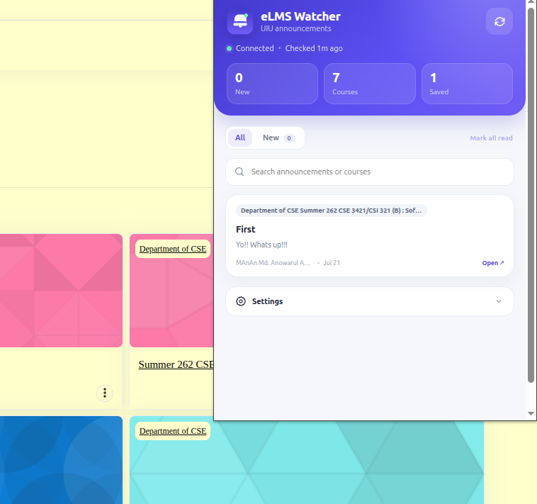
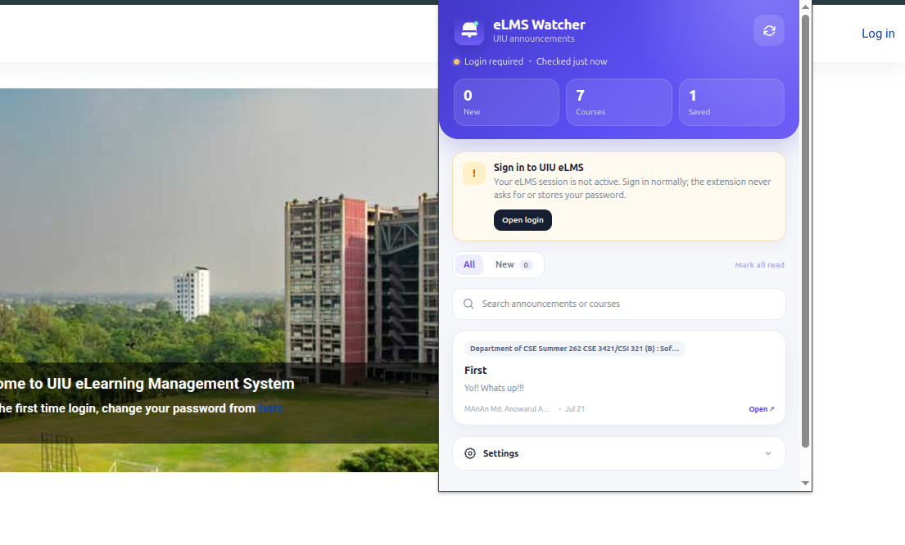

# UIU eLMS Watcher

A Chrome Manifest V3 extension for UIU eLMS that:

- automatically discovers the currently logged-in student's courses in the background;
- finds the **Announcements** and **Assignment**activity inside each course;
- checks the Moodle announcement forum on a schedule;
- stores recent announcements locally in the browser;
- shows announcement titles and available announcement text in a modern popup;
- marks newly discovered posts as **NEW**;
- shows a badge with the unread-new count;
- sends Chrome desktop notifications for newly discovered announcements;
- discovers upcoming assignment due dates from the eLMS calendar;
- shows upcoming assignments beside announcements with a live countdown;
- sends a notification when a new assignment appears;
- sends a due reminder at a custom lead time (60 minutes by default);
- opens the exact announcement when clicked;
- never asks for or stores the student's eLMS password;
- detects a successful eLMS page load and starts checking automatically.

## HOW to Install locally

1. Extract this folder somewhere permanent.
2. In Chrome, open `chrome://extensions/`. 
3. Turn on **Developer mode**.
4. Click **Load unpacked**.
5. Download and extract the extension ZIP file. Select the `uiu-elms-announcement-watcher` folder.
6. Sign in normally at UIU eLMS.
7. Open any eLMS page after signing in. The extension starts automatically.
8. Click the extension icon pin it and press the refresh button if needed.

## First-Time Setup

1. Log in to your UIU eLMS account normally.
2. Open the eLMS dashboard or any other eLMS page.
3. Wait a few seconds while the extension discovers your courses.
4. Click the extension icon in Chrome.

The extension fetches your enrolled courses itself; opening **My Courses** is not required.

## How to Use

- Click the extension icon anytime to see announcements and upcoming assignments.
- New announcements and assignments will be marked as **NEW**.
- You will receive a Chrome notification when either is detected.
- The **Due** tab shows assignment deadlines and a live remaining-time countdown.
- Set the assignment reminder from **Settings** (1 to 10,080 minutes before due).
- Click an announcement to open it directly in eLMS.
- Use **Mark all read** to clear the NEW status.
- Use the search box to find announcements.
- You can change the checking interval from **Settings**.
- You can turn desktop notifications on or off from **Settings**.

## Important

- You must stay logged in to UIU eLMS for the extension to check announcements.
- The extension does not ask for or store your eLMS password.
- On the first scan, existing announcements and assignments establish a quiet baseline. New-item notifications are shown only for items detected later; due reminders still work for upcoming deadlines.

## Extension Preview

